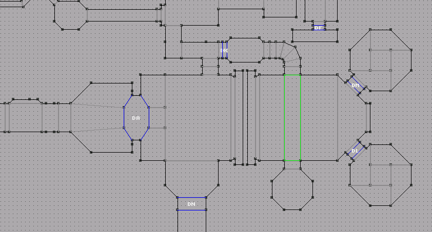
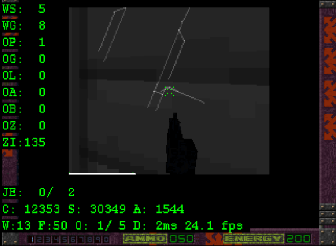
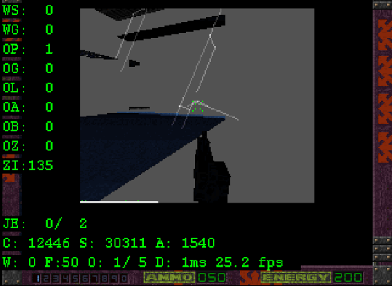
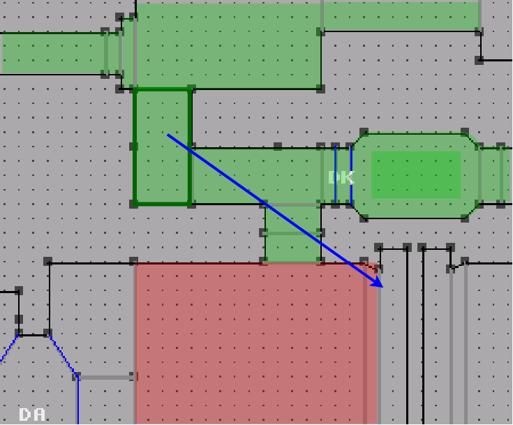
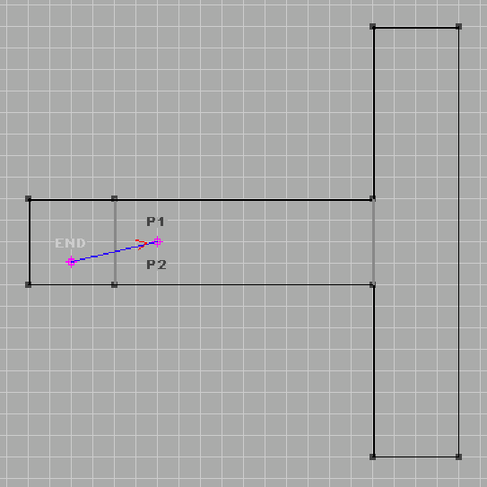
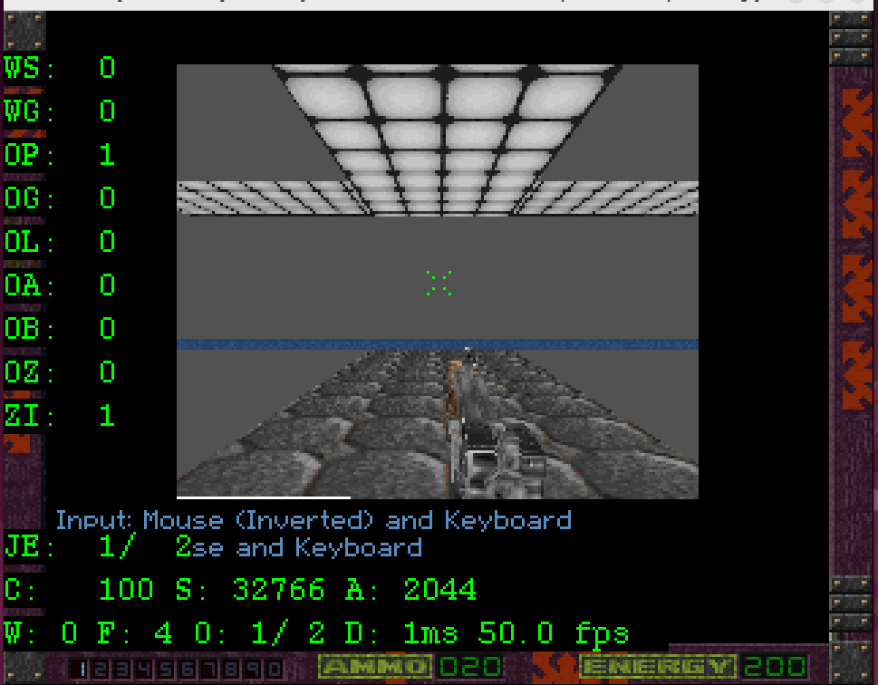

# Development / Potentially Visible Set Rendering

## Map Structure Overview

TKG is a 2.5D game engine. Each level is a 2D map. Points are connected in clockwise order to define convex polygons with 3-10 sides. This polygon, together with height data forms a Zone, which is the fundamental primitive the map is built from. The example image below shows a section of a level map, clearly showing the points and edges that together define the Zones the map is built from.



Notes:

- Solid dark lines indicate a solid "outer" wall edge.
- Lighter grey lines indicate an adjoining edge between Zones.
- Blue lines indicate door or lift zone edges
- Green lines indicate the edges of a zone that has an upper and lower space.

While Zones are required to be convex, it is permitted to have adjacent edges that are completely colinear, i.e. their points fall in a straight line.

What the user thinks of as a "room" may have a more complex, concave shape, such as the left-centre area adjacent Door A in the above map. Neither the engine or the editor has any such concept of a room. Rather this is just a space defined by a set of adjacent Zones that have been given consistent graphical styling.

A Level may have up to 256 Zones defined by up to 800 points (values subject to change). 

## Potentially Visible Sets

It is not possible to see the entire map from any one location. When a map is built, the editor steps through each Zone and compiles a list of every other Zone in the map that has an unblocked line of sight to a point in the Zone. This list forms the Potentially Visible Set or (PVS).

- The PVS also contains the indexes of the Points those Zones are defiend from which allows the runtime to transform and project only the points that matter.
- Information about the edge through which a Zone is seen in is also stored. This allows the renderer to "clip" the maximum rendering extents at runtime.

At runtime, the engine takes note of which Zone the player is in and is then able to test and render only the subset of Zones that are in that Zone's PVS. This saves a lot of computational effort.

## Rendering

Rendering is very simple. Zones are sorted by their centre weighted distance from the player and are then rendered from the furthest to the nearest, ensuring that rendering is restricted to any clips that are relevant. Rendering a Zone draws all of the front facing surfaces and any objects it contains.

The solution aims to ensure that:

- Only the Zones in front of, or partially in front of the player are drawn.
- Each Zone is drawn exactly once.
- Drawing is clipped to the visible width of the edge it is visible through.

The net result is somewhere between a BSP (Convex spaces, precomputed PVS) and Portal renderer.

## Issues

There are some issues and defects with the original solution:

- The PVS determination does not seem to take into account that adjacent Zones can be disconnected due to non-overlapping height ranges.
- The PVS list for a Zone may contain entries that are logically connected but not visibly connected.
- Runtime application of PVS has to test every Zone in the PVS for rendering.
    - These tests are not comletely reliable and frequently glitch.
    - Glitches can reduce performance and/or cause visible corruption.
- The state of Doors and Lift zones are not taken into consideration.
    - This results in significant performance dips when facing door zones.

Invariably, these issues and limitations tend to result in overdraw, where a more distant Zone is rendered, only to be completely drawn over. Examples are shown below:

 

## Improvements

Various algorithmic modifications have been made to try and improve the performance:

### Zone Order Reduction

Originally, the PVS set for the player's Zone was unconditionally sorted on every single frame, regardless of whether or not the player has changed position, which is the only trigger by which the relative order can change.

To address this, a snapshot of the player's X/Z coordinate pair is taken each frame and compared to the previous value. If the value has not changed, there is no need to reorder the zones.

It is also the case that small changes in the player position do not result in a change to Zone ordering in the vast majority of cases. When the player is moving through a Zone, most of the reordering calls will have no effect and are therefore wasted effort.

To address this, a positon mask is defined. This acts to quantise the player's position to a coarser granularity. This granularity is controlled by a preferences setting, `misc.oz_sensitivity`. This is a value from 0-7 which represents how many of the lower bits of the player's X/Z coordinates should be discarded.

| Identifier | Type | Managed By | Notes |
|----------|-------------|:------:|---|
| Prefs_OrderZoneSensitivity | var | C | User-definable preferences setting |
| Zone_MovementMask_l | var | C | Mask constructed from the setting |
| zone_LastPosition_vw | var | Asm | Previous masked player X/Z position |
| Zone_OrderZones | function | Asm | Main entry point for Zone sorting |

See also:

- [orderzones.s](../orderzones.s)
- [game_preferences.c](../c/game_preferences.c#L87)

### PVS Errata

The first attempt to address overdraw issues targeted the problem cases resulting from bugs in the map creation that led to spurious zones.



In the illustrated example above, the shaded zones represent the PVS computed ahead of time by the level editor for the Zone with the green border. It is intuitive from inspection that the Zones shaded in red cannot be seen from anywhere in the Zone. As the bug exists in the editor, it is not clear the underlying cause but it could be due to a faulty ray intersection. The blue arrow reprents a hypothetical ray from the Zone that intersects all of the logically connected Zones to the pair that should be excluded, but should have been terminated when it hit the outer wall of the last green shaded Zone.

Whatever the cause for inclusion, at runtime, there are certain player positions and orientations in the Zone that result in the large red area being rendered, only to be immediately overdrawn by the outer wall.

The mechanism to address this uses a manually created file that contains lists of Zones that contain inclusions in their PVS lists that are never truly visible and should be removed. These files are converted from a user-edited JSON file:

```JSON
{
    "ZonePVSErrata": {
    	"4": [ 17 ],
    	"5": [ 181 ],
    	"34": [ 37 ],
        "36": [ 31 ],
        "37": [ 34, 45, 46, 47, 248 ],
        "38": [ 30, 31 ],
        "40": [ 248 ]
    }
}
```
The structure of the JSON is a simple key-value set of source Zone ID mapped to an array of target Zone IDs that should be removed from the source Zone's PVS. During level load, any errata data is loaded and applied to the PVS data before entering the main game loop.

The compiled representation of the JSON is a simple stream of 16-bit words comprising varying length lists. The first word is the Zone ID the errata list applies to. This is immediately followed by a list of one or more words containinng the IDs of zones in the PVS that should be removed. This list is terminated by a ZONE_ID_LIST_END value. The overall errata data is then also terminated by ZONE_ID_LIST_END.

At level load time, the compiled errata are loaded and the operations in it are applied. When a Zone ID is removed from the PVS, the entries above it are collapsed down to maintain a compact data structure.

Identification of where issues occur for use with the errata mechanism invovles testing the level in the developer build where wall rendering can be enabled/disabled, revealing the floor/ceiling areas of any zones that are being rendered. 

See also:
- [game_preferences.c](../c/zone_errata.c)


### Per Edge PVS

The PVS Errata mechanism is rather laborious and doesn't deal with other classes of bugs that can manifest at runtime. For example, the visibility of indirectly connected zones can change depending on the orientation of the player, resulting in significant overdraw that is not correctable via the Errata method.

To address this, a new load-time mechanism has been added. This visits every Zone in the map and then examines the PVS from the perspective of each of the Zone's joining edges. Generally, where a Zone has more than one shared edge, only a subset of the Zone's PVS will ever be visible via that edge.

The algorithm steps out of each shared edge and then examines the shared edges of the Zone it entered, making note of those that are still front facing from the perspective of the root Zone. This process recurses, marking the subset of the PVS that can be seen from each edge of the Zone.

At runtime, we start with the assumption that only the current zone is visible. Next the player's orientation and field of view is used to determine which shared edges in the current Zone are visible. The zones in the PVS are then tagged as visible or not by checking the per-edge data that was calculated. During the render stage, only the zones from the PVS that were tagged are drawn.

| Identifier | Type | Managed By | Notes |
|----------|-------------|:------:|---|
| Zone_PVSFieldOfView | var | C | User-definable preferences setting for fine tuning |
| Zone_EdgePVSState | struct | C | Tracks state while performing the edge traversal |
| ZEdgePVSHeader | struct | C | Generated result for an edge traversal |


See also:
- [zone_edge_pvs.c](../c/zone_edge_pvs.c)

### Adjacent Zone Clips Enhancement

During the rendering pass, clips are applied to every Zone that is more than one hop away from the Root. The data to drive that is generated during map building. The Zones immediately adjacent the current Zone do not have these data available. Consequently, the immediately adjacent zones are always rendered with the clip extents set to maximum width. This results in an overdraw case shown below:

 


Facing the T-junction, no clips are applied to the adjoining zone, resulting in the full horizontal extent being used. With wall rendering disabled, we can see the impact this has on drawing:

To address this case, we identify the indexes coordinates of the immediately joining edges in the Point data during the Edge PVS processing and ensure they are added to the transformation buffer.

This allows the horizontal extent of the current Zone's shared edge with an adjoing zone to be found post transformation. These are then used to refine the clip extents for the adjacent zone, reducing overdraw in cases where the adjoining zone is larger than the edge.

This mechanism was improved one further step by considering the the complete extent for any immediate shared edges that are visible simultaneously. Without this, the clipping could only be applied when a single shared edge was visible.

### Per Edge Door Mask

When considering the PVS, Zones defined as doors are considered as open. Consequently whatever is behind them is drawn first, then the closed wall of the door is drawn over them. For doors that are far away, this may only represent a minor degree of overdraw. However, approaching the door results in an ever larger area being drawn and then overdrawn, resulting in highly conspicuous drops in performance. 

To address this, as part of the per-edge PVS data that is computed on level loading we determine which PVS lists contain one or more doors. For those that do, we also include an entry for each Zone in the PVS that indicates which doors must be open for the corresponding Zone to be considered visible. This entry is a bitmask, with each bit representing one of the (currently 16) possible doors.

During traversal out from an edge, we begin with an empty mask. For each Zone that we recurse through, if the zone is a door, we set the corresponding door index bit in the mask. These accumulate as we enter deeper parts of the tree, indicating that these zones may require multiple doors to be open for the corresponding zone to be visible.

This mechanism introduces a challenge to the previously simple method of marking aleady visited zones as seen, since there are now implied levels of visibility. During traversal, for every zone that was seen that had a non-empty doormask, if the current zone/edge combination we are starting from has no obstructions, we will revisit those zones to ensure their visibility is updated. 

See also:
- [zone_edge_pvs.c](../c/zone_edge_pvs.c)
- [zone_door_pvs.c](../c/zone_door_pvs.c)
