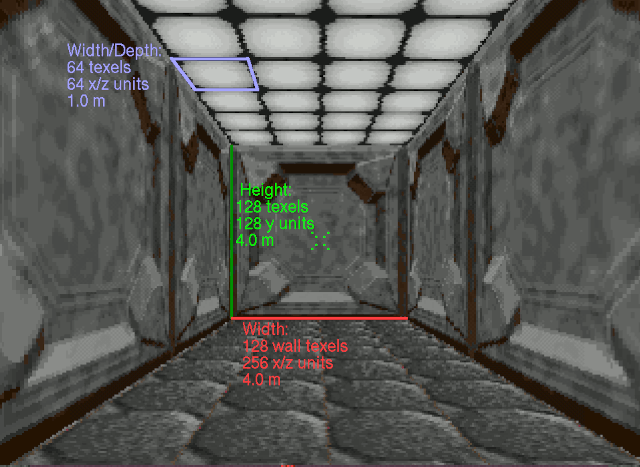

# Documentation

## Overview

The purposed of this documentation is to record notes and findings that go beyond the commenting in the source code.

## Map Coordinate System

The game engine uses a fixed-point coordinate system. Generally, signed 16-bit values are used to represent component ordinates, though in some cases, 32-bit values appear to be used. It is not clear if this is an early design artefact or to permit fractional precision or potentially both. Negative values are legal and the plan origin is at 0, 0.

Using the four cardinal directions:

 - X represents the East/West direction.
     - Value increases from East to West.
 - Z represents the North/South direction.
     - Value increases from North to South.

Vertically:

 - Y represents the altitude.
     - Value increases towards the ground.

### Scale

Based on the Level Editor, every 32 steps in the Y direction corresponds to 1 metre. However, based on the coordinate data in the map structures, the resolution in the X and Z directions are doubled to 64 steps per metre.

Wall texture coordinates adopt the same scale as the Y direction. An unscaled 128x128 texture will repeat every 128 steps in the Y direction and every 256 steps in the X/Z directions.

Floor texture coordinates adopt the same scale as the X/Z directions. All floor/ceiling textures are 64x64 and at the default scaling (0) will tile twice in the space that a 64 wide wall texture occupies. In game:

The player eye level when standing corresponds to a height of 48 Y units (1.5 metres), and 32 Y units (1.0 metres) when crouched.